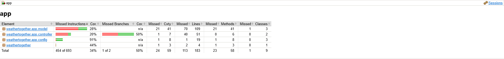

# weather-together-backend

## Description
Backend for Weather Together, a web app to view two cities' weather forecasts

## Instructions
To run the server locally, use ```./mvnw spring-boot:run```. By default, the server runs at http://localhost:8080. 
The url in CorsConfig should also be changed to ```http://localhost:3000``` or whatever port the frontend is running on.

## Testing
Run the tests locally using Maven with ```mvn test``` (after setting up your own MongoDB credentials in a ```.env``` file. This will generate a code coverage report in ```weather-together-backend\target\site\jacoco```.

The current tests have a code coverage of 50% (branches).



## Deployment
The server is currently deployed to Google Cloud Platform using App Engine. There is a separate ``` MongoConfig``` file for this deployment, as well as an ```app.yaml``` config file for GCP-specific config.

The application (with frontend) is available live at https://weather-together-web.netlify.app/.
